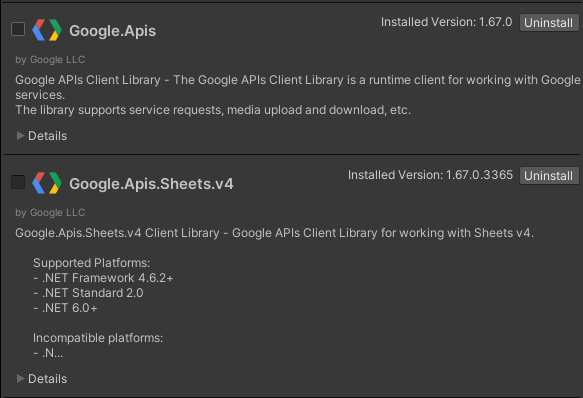
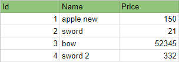

# 👉 Kimicu Google Sheets Importer for Unity 👈
## 🟢 Описание
Этот ассет был разработан с целью получения данных их гугл таблиц

Было разработанно специально для игровой студии `ImmortalsGames`
## 🟡 Как установить
1) Для начала добавьте `NuGetForUnity`:
   <details>
   <summary>Unity 2019.3 или новее</summary>
   
   1.1. Открыть Package Manager window (Window | Package Manager)<br>
   1.2. Нажмите кнопку `+` в левом верхнем углу окна и выберите "Add package from git URL..."<br>
   1.3. Введите следующий URL-адрес и нажмите кнопку `«Добавить»`. 
   ```
   https://github.com/GlitchEnzo/NuGetForUnity.git?path=/src/NuGetForUnity 
   ```
      
   </details>
   <details>
   <summary>Unity 2019.2 или ранее</summary>

   1.1. Закрыть Unity Editor<br>
   1.2. Открыть Packages/manifest.json любым текстовым редактором<br>
   1.3. Вставьте следующую строку после `"dependencies": {`, и сохраните файл.<br>
   ```json
   "com.glitchenzo.nugetforunity": "https://github.com/GlitchEnzo/NuGetForUnity.git?path=/src/NuGetForUnity",
   ```
   1.4. Снова откройте проект Unity в редакторе Unity.

   </details>

2) Далее установите нужные  пакеты через `NuGet` > `Manage NuGet Package`<br>


3) Далее добавляем `UniTask`, скачиваем по 
   [ссылке](https://github.com/Cysharp/UniTask/releases/tag/2.5.4) 
   и добавляем в  проект.

4) Далее добавим `Kimicu Google Sheet Importer for Unity`:
   <details>
   <summary>Unity 2019.3 или новее</summary>
   
   1.1. Открыть Package Manager window (Window | Package Manager)<br>
   1.2. Нажмите кнопку `+` в левом верхнем углу окна и выберите "Add package from git URL..."<br>
   1.3. Введите следующий URL-адрес и нажмите кнопку `«Добавить»`.
   ```
   https://github.com/Kitgun1/KimicuGoogleSheetImporter-for-Unity.git 
   ```

   </details>
   <details>
   <summary>Unity 2019.2 или ранее</summary>

   1.1. Закрыть Unity Editor<br>
   1.2. Открыть Packages/manifest.json любым текстовым редактором<br>
   1.3. Вставьте следующую строку после `"dependencies": {`, и сохраните файл.<br>
   ```json
   "com.kimicu.googlesheetimporter": "https://github.com/Kitgun1/KimicuGoogleSheetImporter-for-Unity.git",
   ```
   1.4. Снова откройте проект Unity в редакторе Unity.

   </details>

## 🟠 Получение данных из Google таблицы
###  Подготовка
1) Создайте папку, в которой будем все обрабатывать.
2) Создаем в этой папке `Assembly Difinition Reference`.
3) В поле `Assembly Difinition` указываем `Kimicu.GoogleSheetImporter` и сохраняем.

### Таблицы
1) Создайте новые скрипты с названием таблиц, например:<br>
У нас есть вот такая таблица:<br>


2) Теперь зная таблицу, надо написать скрипт для хранения каждого поля,
   в  нашем случае это:
   ```csharp
   [Serializable]
   public class ItemSettings
   {
      public string Id;
      public string Name;
      public int Price;
   }
   ```

### Напишем GameSettings
1) Создайте скрипт `GameSettings`.
2) Добавьте аттрибут `[Serializable]`.
3) Установите namespace - `Kimicu.ExcelImporter`.
4) Добавьте список всех таблиц в `GameSettings`, например:
   ```csharp
   public List<ItemSettings> Products;
   ```

### Напишем Парсер для данных
1) Создаем новый скрипт, например `ItemSettingsParser`.
2) Наследуем его от `IGoogleSheetParser` и имплиминтируем нужные методы.
3) Далее напишем конструктор, который  будет принимать в качестве аргумента `GameSettings`.
4) Кешируем и инициализируем  всве внутренние поля.
5) Прописываем  логику для метода `Parse(string header, string token)`:
   ```csharp
   switch (header)
   {
      case "Id":
         _currentItemSettings = new ItemSettings() { Id = token };
         _gameSettings.Products.Add(_currentItemSettings);
         break;
      case "Name":
         _currentItemSettings.Name = token;
         break;
      case "Price":
         _currentItemSettings.Price = Convert.ToInt32(token);
         break;
      default:
         throw new Exception($"Invalid header: {header}!");
   }
   ```

### Получение данных из листа таблицы
1) В верхнем меню выбираем `Kimicu` > `Config Import`.
2) Выбираем  существующий или создаем новый в папке `Resources`
3) `SPREADSHEET_ID` берем из ссылки таблицы
   
4) `CREDENTIALS_PATH` - json файл с кренделями, который в лежит в корневой папке проекта
   Получить его можно в Google Developer Console, создав новый проект, добавив сервис аккаунт и ключ к нему
6) `ITEMS_SHEET_NAME` - Название листа из Google Sheets
7) `SETTINGS_FILE_NAME` - Название файла, в котором будет json строка с данными из таблицы
8) `PARSER NAME` - название скрипта парсера, который унаследован от `IGoogleSheetParser`
9) После нажатия на кнопку `Load Items Settings`, задите в папке `Resources` и сделайте Refresh папки
